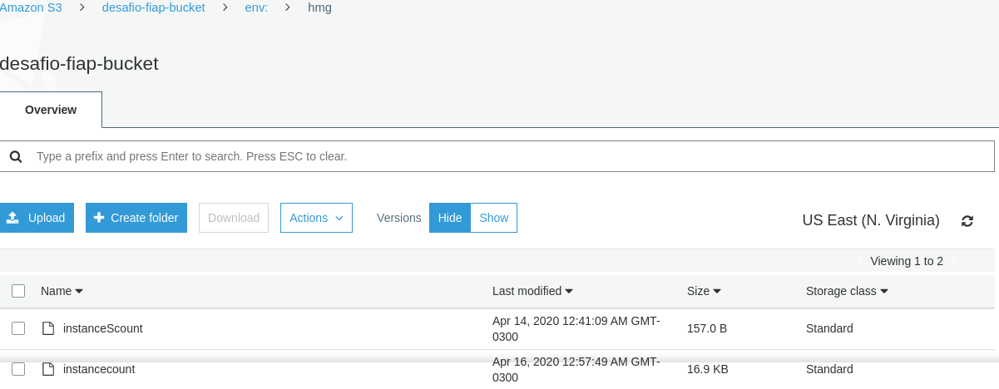

Utilize o código da demo Count e faça as seguintes mudanças:

    1 - Adicione estado remoto no S3
    2 - Mude os arquivos para que os arquivos virem um módulo que recebe a quantidade de nós no load balancer
    3 - Monte o arquivo que chama o módulo recem criado.
    4 - Os nomes das maquinas devem ser de acordo com o ambiente do workspace. Ex: nginx-workspace-002
    5 - O nome do ELB e do Securitygroup também devem conter o workspace
    6 - Crie um ambiente de dev
    7 - Faça um zip dos arquivos desse exercicio e submeta no portal da fiap.

    https://github.com/vamperst/hybridnativecloud-exercises-terraform/tree/master/Desafio

    Nome de maquina:
    Name = "${format("nginx-%s-%03d", terraform.workspace,count.index + 1)}"

---

# Resolução do Exercício:

Transformado o exercício `Count` feito em sala de aula, efetuando os ajustes solicitados no enunciado.

1. - Estado remoto no [S3](https://desafio-fiap-bucket.s3.amazonaws.com)
2. - Workspace para os ambientes `stg`, `hmg`, `prod`.
3. - Criado o `Count-call` para chamada remota do modulo Count.
4. - Definido nome das instâncias com o sufixo `nginx-environment-0`.
5. - Para cada ambiente foi adicionado o sufixo `environment` no `security group` e `ELB`.
6. - Adicionado os ambientes de `stg`, `hmg`,  `prod`.
7. - Para cada passo executado nesta tarefa tem um `print screen` demonstrando a conclusão do passo.

---

## Execução do Modulos:

### Passos a serem executados:

1. Acessar o diretório `vpc-call` e executar os comandos abaixo:

    1.1 Executar o comando `terraform init` para iniciar os modulos do terraform.

    1.2 Executar o plano pelo terraform, com o comando `terraform plan`.

    1.3 Executar o apply para criar os recursos pelo terraform com o comando `terraform apply -auto-approve`.

2. Acessar o diretório RT-call e executar os comandos abaixo:

    2.1 Executar o comando `terraform init` para iniciar os modulos do terraform.

    2.2 Executar o plano pelo terraform, com o comando `terraform plan`.

    2.3 Executar o apply para criar os recursos pelo terraform com o comando `terraform apply -auto-approve`.

3. Acessar o diretório Count-call e executar os comandos abaixo:

    3.1 Executar o comando `terraform init` para iniciar os modulos do terraform.

    3.2 Executar o plano pelo terraform, com o comando `terraform plan`.

    3.3 Executar o apply para criar os recursos pelo terraform com o comando `terraform apply -auto-approve`.

4. Acessar o bucket e verificar os arquvios gerados pelo `state` dos modulos `vpc-call`, `rt-call`, e `count-call`.

---

## Terraform VPC Module:

### Terraform Init:

---

### Terraform Approve:

---

### Resultado da criação da VPC:

---

## Terraform Route table Module:

### Terraform init no Modulo da tabela de Roteamento:

---

### Terraform Apply no Modulo da tabela de Roteamento:

---

### Resultado da Criação do Internet Gateway:

---

### Resultado da Criação da ACLS:

---

### Resultado da Criação da Subnets:

---

### Resultado da Criação Tabela de Roteamento:

---

## Terraform Workspace Module:

### Resultado da Criação dos ambientes do workspace:

---

### Selecionando um Workspace:

---

### Gerando o plano do Terraform:

---

### Listando os ambientes criados no Terraform Workspace:

---

## Resultados do exercício:

### Instancias provisionadas pelo Terraform:

---

### Security Group provisionadoa pelo Terraform:

---

### ELB provisionados pelo Terraform:

---

### Acessando Nginx do ambiente hmg:

---

### Acessando Nginx do ambiente prod:

---

### Acessando Nginx do ambiente stg:

---

### Resultado gerado no Bucket:

### State no S3 dos Modulos VPC e RT:

---

### State no S3 do Modulo Workspace:

---

### State no S3 do Modulo Workspace de hmg:

### State no S3 do Modulo Workspace de prod:

---

### State no S3 do Modulo Workspace de stg:

---

### **Grupo:**

Este Trabalho foi desenvolvido para à matéria de **Hybrid Native cloud** do **MBA - Fullstack developer, Microservices, Cloud e IOT**

`Pelos alunos:`

| Nome | RM|
|-------|:---:|
|**Flávio Alves Ferreira da Silva** |`RM: 333565`|
|**Milton Luiz Ribeiro Junior** |`RM: 333949`|
|**Pedro Madi Della Coletta** |`RM: 334109`|
|**Rafael Miranda de Almeida** |`RM: 333829`|
|**Rodrigo de Almeida Pereira** |`RM: 333241`|
|**Wellington Moreira Bastos** |`RM: 333878`|
|||

---