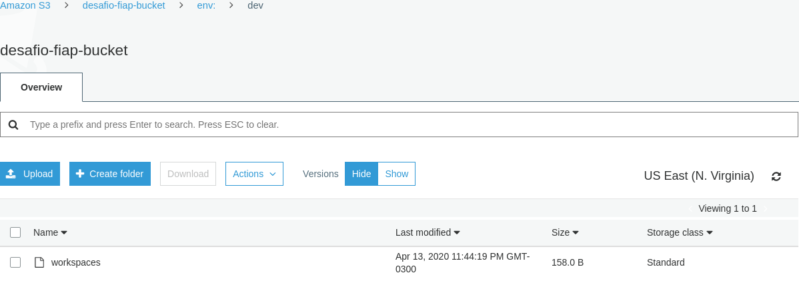

Utilize o código da demo Count e faça as seguintes mudanças:

    1 - Adicione estado remoto no S3
2 - Mude os arquivos para que os arquivos virem um módulo que recebe a quantidade de nós no load balancer
3 - Monte o arquivo que chama o módulo recem criado.
    4 - Os nomes das maquinas devem ser de acordo com o ambiente do workspace. Ex: nginx-workspace-002
    5 - O nome do ELB e do Securitygroup também devem conter o workspace
    6 - Crie um ambiente de dev
    7 - Faça um zip dos arquivos desse exercicio e submeta no portal da fiap.

https://github.com/vamperst/hybridnativecloud-exercises-terraform/tree/master/Desafio

Nome de maquina:
Name = "${format("nginx-%s-%03d", terraform.workspace,count.index + 1)}"

---

